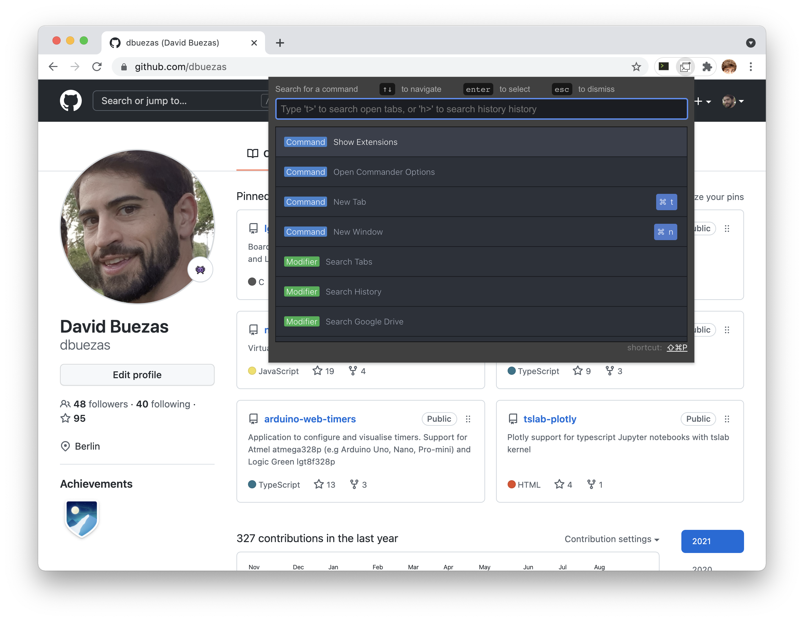

# Chrome-palette

A SublimeText/Atom/Vscode style command palette for chrome!



## Installation

Soon in the Chrome Extensions store.

For now you can unzip [chrome-palette.zip](https://github.com/dbuezas/chrome-palette/raw/master/chrome-palette.zip) and load it unpacked from [chrome://extensions](chrome://extensions)

## Features

- [x] Commands sorted by usage
- [x] Fuzzy search of commands
- [x] Search open tabs
- [x] Search history
- [x] Search in gdrive

## Command list

- New Tab
- New Window
- Show History Page
- Show Downloads
- Show Extensions
- Show Bookmarks
- Show Settings
- Close Current Tab
- Reload Tab
- Reload All Tabs
- Clear Cache and Reload Tab
- Toggle Pin
- Duplicate Tab
- New Incognito Window
- Close Other Tabs
- Close Tabs To Right
- Close Tabs To Left
- Mute/Unmute Tab
- Move Tab To Start
- Move Tab To End
- Move Tab Left
- Move Tab Right
- Reopen/Unclose Tab
- Deattach Tab (Move to New Window)
- Reattach Tab (Move Tab to Previous Window)
- Reset command history
- Search Tabs
- Search History
- Search Google Driveg
- Search Youtube
- Search Google
- Search Wikipedia

## Development

```bash
npm install
npm start
```

## Full Manual testing

Import the dist folder as an unpacked extension in chrome. This folder is rebuilt on changes when using `npm start`
