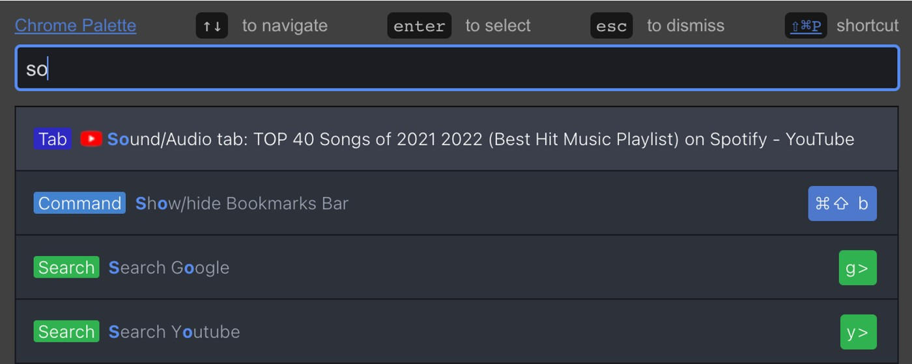

# Chrome-palette

A SublimeText/Atom/Vscode style command palette for chrome!

## Installation

[Chrome Web Store](https://chrome.google.com/webstore/detail/chrome-palette/hjkpneggcnclhpkddehdhlkeljclcnbo)

Or you can unzip [chrome-palette.zip](https://github.com/dbuezas/chrome-palette/raw/master/chrome-palette.zip) and load it unpacked from [chrome://extensions](chrome://extensions)



## Features

- [x] Commands sorted by usage
- [x] Fuzzy search of commands
- [x] Search sub commands (open tabs, bookmarks, history, etc)

## Command list

- [x] New Tab
- [x] New Window
- [x] Open History Page
- [x] Open Downloads
- [x] Open Extensions
- [x] Open Bookmarks
- [x] Add this tab to Bookmarks
- [x] Open Settings
- [x] Close Current Tab
- [x] Reload Tab
- [x] Reload All Tabs
- [x] Clear Cache and Reload Tab
- [x] Toggle Pin
- [x] Duplicate Tab
- [x] New Incognito Window
- [x] Close Other Tabs
- [x] Close Tabs To Right
- [x] Close Tabs To Left
- [x] Mute/Unmute Tab
- [x] Move Tab To Start
- [x] Move Tab To End
- [x] Move Tab Left
- [x] Move Tab Right
- [x] Reopen/Unclose Tab
- [x] Deattach Tab (Move to New Window)
- [x] Reattach Tab (Move Tab to Previous Window)
- [x] Reset command history
- [x] Toggle Full screen mode
- [x] Search Tabs
- [x] Search History
- [x] Search Google Drive
- [x] Search Youtube
- [x] Search Google
- [x] Search Wikipedia

## Development

```bash
npm install
npm start
```

## Full Manual testing

Import the `dist` folder as an unpacked extension in chrome. This folder is rebuilt on changes when using `npm start`

# Previous art

- Commander: https://github.com/ssundarraj/commander
